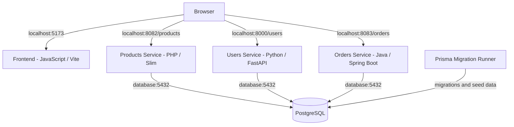

# Module 1 — System Map

## 1. System diagram



The frontend is opened in the browser on port `5173`.

The JavaScript running in the browser sends requests to the three backend services:

- Products Service — port `8082`
- Users Service — port `8000`
- Orders Service — port `8083`

The backend services connect to PostgreSQL using the service name `database`.

The migration runner prepares the database and then exits.

---

## 2. Request trace — loading products

The request that loads the products on the main page was traced.

### Step 1 — Products API URL

The Products API URL is set in:

`frontend/src/main.js:7`

```js
productsApiUrl: import.meta.env.VITE_PRODUCTS_API_URL || 'http://localhost:8082'
```

With the `.env` file, the Products Service is available at:

```text
http://localhost:8082
```

### Step 2 — Product loading starts

The frontend calls the product rendering function here:

`frontend/src/main.js:55`

```js
renderProducts(config.productsApiUrl)
```

### Step 3 — The `/products` URL is created

Inside `renderProducts`, `/products` is added to the API URL:

`frontend/src/components/products.js:11`

```js
const products = await fetchData(`${apiUrl}/products`)
```

The final request is:

```text
GET http://localhost:8082/products
```

### Step 4 — Browser sends the request

The request is sent using `fetch()`:

`frontend/src/api/api.js:8`

```js
const response = await fetch(url)
```

Docker maps port `8082` on my computer to port `80` inside the Products Service container.

### Step 5 — PHP receives the request

The Products Service has this route:

`products-service/public/index.php:26`

```php
$app->get('/products', function (Request $request, Response $response, $args) {
```

This route handles `GET /products`.

### Step 6 — Connection to PostgreSQL

The database settings are read here:

`products-service/public/index.php:27-31`

The PostgreSQL connection is created here:

`products-service/public/index.php:33-39`

The database host is `database`, because this is the Docker Compose service name.

### Step 7 — Database query

The Products Service reads the products from the `Product` table:

`products-service/public/index.php:41`

```php
$stmt = $pdo->query("SELECT * FROM \"Product\"");
```

The result is read here:

`products-service/public/index.php:42`

```php
$products = $stmt->fetchAll();
```

### Step 8 — PHP returns JSON

The result is converted to JSON:

`products-service/public/index.php:44-45`

```php
$response->getBody()->write(json_encode($products));
return $response->withHeader('Content-Type', 'application/json');
```

### Step 9 — Frontend reads the JSON

The frontend converts the response from JSON:

`frontend/src/api/api.js:12`

```js
return await response.json()
```

### Step 10 — Products are shown on the page

The product cards are created here:

`frontend/src/components/products.js:18-29`

The code uses:

```js
products.map(...)
```

and puts the generated HTML into:

```js
container.innerHTML
```

So the full request path is:

```text
Browser
  ↓
main.js
  ↓
renderProducts()
  ↓
GET http://localhost:8082/products
  ↓
Products Service
  ↓
GET /products route
  ↓
PostgreSQL Product table
  ↓
JSON response
  ↓
Frontend
  ↓
Product cards in the browser
```

---

## 3. Environment gotchas

### Missing `.env` file

On the first start I ran:

```text
docker compose up -d --build
```

but Docker showed warnings like:

```text
The "FRONTEND_PORT" variable is not set.
The "DB_USER" variable is not set.
```

At the end I also got:

```text
invalid proto:
```

The repository had `.env.example`, but there was no `.env` file.

I fixed it with:

```text
copy .env.example .env
```

After that Docker could read the ports and database settings correctly.

The first build took about 500 seconds.

### Migration runner

After starting the system, `docker compose ps -a` showed:

```text
migration-runner   Exited (0)
```

At first this looked like the container had stopped because of a problem.

After checking the project, I understood that this container is supposed to run once, prepare the database, and then exit.

`Exited (0)` means it finished successfully.

---

## 4. Documentation difference

In `ARCHITECTURE.md`, the Products Service is described as:

> **Role**: Manages product catalog (CRUD operations).

However, in the current version of the project, the Products Service only has a read-only endpoint:

`products-service/public/index.php:26`

```php
$app->get('/products', function (Request $request, Response $response, $args) {
```

There are currently no `POST`, `PUT`, `PATCH` or `DELETE` endpoints for products.

So at this stage the Products Service can only read the product catalog. Full CRUD functionality is not implemented yet.

---

## 5. Research notes

### 1. What does `docker compose up` do in this project?

`docker compose up -d --build` reads `docker-compose.yml` and `.env`.

It builds the services, creates the Docker network and volume, starts PostgreSQL, then starts the other services.

The migration runner starts when the database is ready, applies the database setup, and then exits.

The first run took much longer because Docker had to download and build everything.

The next runs are faster because Docker can reuse existing images and cache.

---

### 2. How does one container reach another by name?

Inside Docker, containers use service names instead of `localhost`.

For example, the backend services connect to PostgreSQL using:

```text
database:5432
```

`database` is the name of the PostgreSQL service in `docker-compose.yml`.

Docker resolves this name automatically.

From the browser I use:

```text
localhost:8082
localhost:8000
localhost:8083
```

because the browser is outside the Docker network.

So I understood it like this:

```text
inside Docker -> service name
from browser -> localhost + published port
```

---

### 3. What is the difference between a container, image and volume?

An **image** is what Docker uses to create a container.

A **container** is the running application.

A **volume** stores data separately from the container.

PostgreSQL uses the volume:

```text
postgres_data
```

If I run:

```text
docker compose down
```

the containers stop and are removed, but the database data stays.

If I run:

```text
docker compose down -v
```

the volume is also removed, so the stored database data is deleted.

---

### 4. What does the Prisma migration runner do?

The migration runner prepares the database.

It applies the Prisma migrations and adds the sample data.

It is separate from the Products, Users and Orders services.

After it finishes its job, it stops.

That is why this is normal:

```text
migration-runner   Exited (0)
```

`0` means it finished successfully.

---

### 5. Why does this system use four languages?

The frontend uses JavaScript.

The backend services use PHP, Python and Java.

The benefit is that different services can use different technologies.

The problem is that the project becomes harder to understand and maintain because there are more languages, frameworks and build tools.

For me, the main idea is that the services can still work together even if they are written in different languages.